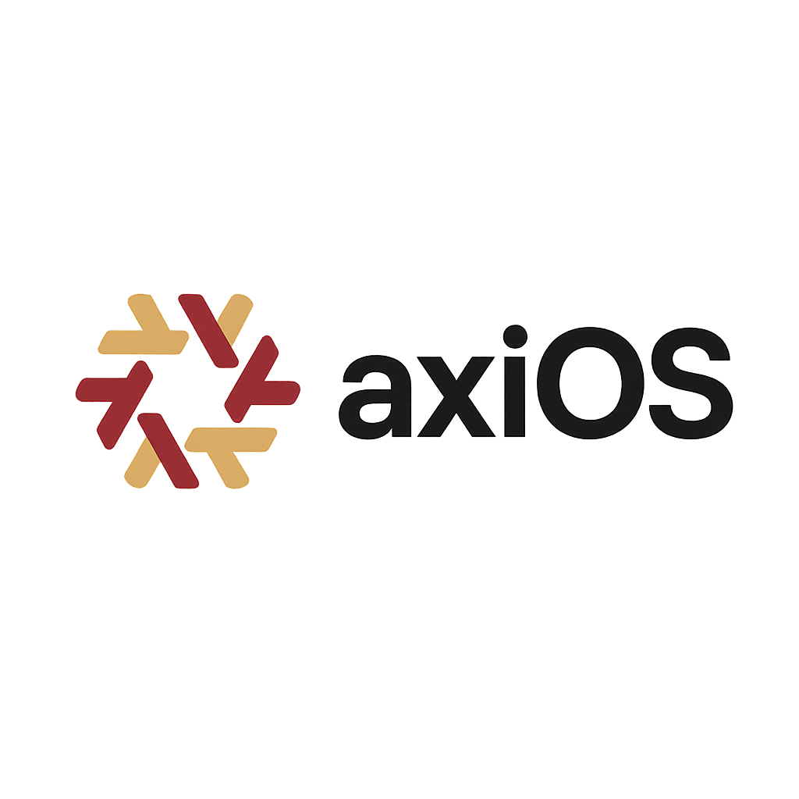

# axiOS

<p align="center">

</p>

<p align="center">
<em>A modular <a href="https://nixos.org">NixOS</a> framework and library for building reproducible systems with <a href="https://github.com/nix-community/home-manager">Home Manager</a>, modern desktop environments, and curated development tools.</em>
</p>

## What is axiOS?

axiOS is a **NixOS framework and library** that you import into your own flake to build NixOS configurations. Think of it as a curated collection of modules, packages, and home-manager configs that work together.

You maintain just a few simple files (~30 lines), and axios provides everything else: desktop environment, development tools, system configuration, and more.

## Quick Start

### Use the Interactive Generator (Recommended) ⭐

```bash
mkdir ~/my-nixos-config && cd ~/my-nixos-config
nix run --extra-experimental-features "nix-command flakes" github:kcalvelli/axios#init
```

The generator creates a complete configuration tailored to your system in minutes.

### Manual Configuration

For manual setup, you'll create just 3 files:
- `flake.nix` - Import axios and configure your system (~30 lines)
- `user.nix` - Your user account settings (~15 lines)
- `disks.nix` - Filesystem configuration (~10 lines)

**See [docs/INSTALLATION.md](docs/INSTALLATION.md) for complete step-by-step instructions.**

## Features

### Desktop Experience
- **[Niri compositor](https://github.com/YaLTeR/niri)** - Scrollable tiling Wayland compositor with workspace overview
- **DankMaterialShell** - Material design shell with:
  - System monitoring widgets (CPU, RAM, disk usage)
  - Clipboard history management (cliphist)
  - VPN status widget
  - Brightness controls (screen & keyboard)
  - Color picker and dynamic theming (matugen)
  - Audio visualizer (cava)
  - Calendar integration (khal)
  - Built-in polkit agent
- **Idle management** - Automatic screen power-off after 30 minutes (configurable)
- **Wallpaper blur effects** - Automatic blur for overview mode
- **Ghostty terminal** - Modern GPU-accelerated terminal with dropdown mode
- **LazyVim** - Pre-configured Neovim with LSP support
- **Hardware acceleration** - Optimized for AMD/Intel/Nvidia graphics
- **Google Drive sync** - Automatic rclone-based sync with safety features (run `setup-gdrive-sync`)

### Development
- **Multi-language environments** - Rust, Zig, Python, Node.js
- **DevShells** - Project-specific toolchains via `nix develop`
- **LSP support** - Language servers pre-configured
- **Development tools** - Organized by category

### Infrastructure
- **Declarative disks** - Disko templates for automated provisioning
- **Secure boot** - Lanzaboote support
- **Virtualization** - libvirt, QEMU, Podman
- **Hardware optimization** - Automatic desktop/laptop configuration
- **Modular architecture** - Enable only what you need
- **Self-hosted services** - Caddy + Tailscale HTTPS, Immich photo backup

## Screenshots

### Niri Overview

*[Niri](https://github.com/YaLTeR/niri) scrollable tiling compositor with workspace overview*

### Dropdown Terminal

*Ghostty terminal with dropdown mode and custom theming*

### File Manager

*Nautilus file manager with custom theme integration*

## Documentation

**📖 [Complete Documentation Hub](docs/README.md)** - Start here for comprehensive guides

**Quick Links:**
- [Installation Guide](docs/INSTALLATION.md) - Step-by-step setup
- [Application Catalog](docs/APPLICATIONS.md) - See what's included
- [Library API Reference](docs/LIBRARY_USAGE.md) - Using `axios.lib.mkSystem`
- [Adding Multiple Hosts](docs/ADDING_HOSTS.md) - Multi-host setups

## Library API

axiOS exports `axios.lib.mkSystem` for building NixOS configurations with minimal code:

```nix
nixosConfigurations.myhost = axios.lib.mkSystem {
hostname = "myhost";
formFactor = "desktop";  # or "laptop"
hardware = { cpu = "amd"; gpu = "amd"; };
modules = { desktop = true; development = true; };
userModulePath = ./user.nix;
diskConfigPath = ./disks.nix;
};
```

**See [docs/LIBRARY_USAGE.md](docs/LIBRARY_USAGE.md) for complete API documentation and all available options.**

## Examples

Check out these example configurations:

- [examples/minimal-flake](examples/minimal-flake/) - Minimal single-host configuration
- [examples/multi-host](examples/multi-host/) - Multiple hosts with shared config

## What's Included

- **Desktop**: Niri compositor with scrollable tiling, DankMaterialShell with widgets, Ghostty terminal, idle management, Google Drive sync
- **Development**: Rust, Zig, Python, Node.js toolchains with LSP support
- **Applications**: 80+ apps including productivity, media, and utilities - see [Application Catalog](docs/APPLICATIONS.md)
- **PWAs**: Progressive Web Apps integrated as native applications
- **Virtualization**: libvirt, QEMU, Podman support (optional)
- **Gaming**: Steam, GameMode, Proton (optional)
- **AI Services** (optional):
  - Cloud AI: Claude Code, GitHub Copilot CLI with MCP servers
  - Local LLM: Ollama + Alpaca + OpenCode with ROCm acceleration
  - 32K context window for agentic coding
- **Self-Hosted Services**: Caddy reverse proxy with Tailscale HTTPS, Immich photo backup (optional)

**See project structure and module details in [docs/README.md](docs/README.md)**

## Why axiOS?

- ✅ **Minimal maintenance** - Your config is ~30 lines, axios handles the rest
- ✅ **Selective updates** - `nix flake update` to get new features when you want
- ✅ **Version pinning** - Lock to specific axios versions for stability
- ✅ **Clear separation** - Your personal configs vs framework code
- ✅ **Easy sharing** - Your config repo is simple and understandable
- ✅ **Community framework** - Benefit from improvements and updates
- ✅ **Library design** - Not a personal config - no hardcoded regional defaults

### Library Philosophy

axiOS is designed as a **framework/library**, not a personal configuration:

- **No regional defaults** - You must explicitly set timezone and locale (no assumptions about your location)
- **No hardcoded preferences** - Personal choices belong in your config, not the framework
- **Modular by design** - Enable only what you need, customize everything
- **Multi-user ready** - Built for diverse users with different needs

This means some options are **required** (like `axios.system.timeZone`) to force explicit configuration rather than assuming defaults that might not fit your use case.

## Contributing

Contributions welcome! This is a public framework meant to be used by others.

- Report issues for bugs or missing features
- Submit PRs for improvements
- Share your configurations using axios
- Improve documentation

## Acknowledgments

Built with and inspired by:
- [NixOS](https://nixos.org) and the nix-community
- [Home Manager](https://github.com/nix-community/home-manager)
- [Niri](https://github.com/YaLTeR/niri) compositor
- [DankMaterialShell](https://github.com/AvengeMedia/DankMaterialShell)
- Countless community configurations and blog posts

## License

MIT License. See [LICENSE](LICENSE) for details.
